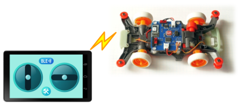

GPduino
=========

## 概要
GPduinoは、Arduino+Konashi互換のBLEラジコン制御ボードです。  
GPduinoに関する詳細は、[GPduino特設ページ](http://lipoyang.net/gpduino)をごらんください。  
GPduinoの回路/基板設計データとプリセットファームウェアのソースをここに公開します。

　　　　　

## ファイル一覧

* firm/GPduinoR3/ : ファームウェア(Arduino Pro Mini 3.3V 互換のスケッチ)
* hard/GPduinoPCB/
	* GPduino.sch/brd: 回路/基板設計データ(Eagle形式)
	* GPduino.pdf: 回路図(PDF)
	* GPduino_BOM.xlsx: BOMリスト(Excel形式)
	* GPduino.GBL/GBO/GBP/GBS/GML/GTL/GTO/GTP/GTS/TXT: ガーバデータ
* LICENSE: Apache Licence 2.0です。
	* ただし、回路/基板設計は、Creative Commons Attribution Share-Alike 3.0です。
* README.md これ

## ブートローダの書き込み
部品実装したGPduino基板をArduinoとして使用できるようにするには、まずブートローダを書き込みます。
* ISPコネクタ（CN12）にISPプログラマーを接続します。向きに注意してください。
	* 3.3V系のArduino (Arduino Pro Mini 3.3V版など)をISPプログラマーにすることができます。File > Examples > Arduino ISP をArduinoに書き込んでください。
* Arduino IDEにて、Tools > Board で、Arduino Pro or Pro Mini を選びます。
* Tools > Processor で、ATmega328(3.3V, 8MHz) を選びます。
* Tools > Programmer で、ISPプログラマーを選びます。
	* 上記の、Arduinoを使ったISPプログラマーの場合は、Arduino as ISPを選んでください。（名前が紛らわしいですが、ArduinoISPではありません。）
* Tools > Burn Bootloader で、ブートローダーを書き込みます。

## ファームウェアの書き込み
GPduinoは、Arduino Pro Mini 3.3V版互換機です。
* 書き込みはArduino Pro Miniと同様、USBシリアル変換基板が必要です。CN13に接続してください。
	* SparkFun製 FTDI Basic Breakout - 3.3V を推奨します。かならず、3.3Vのものを使用してください。
* 基板のジャンパJ3を[USB]側に設定してください。
* Arduino IDEにて、Tools > Board で、Arduino Pro or Pro Mini を選びます。
* Tools > Processor で、ATmega328(3.3V, 8MHz) を選びます。
* Tools > Port で、USBシリアルのポート番号を選びます。
* Uploadボタンで、ファームウェアを書き込みます。
