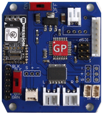

GPduino
=========

## 概要
GPduinoは、Arduino+Konashi互換のBLEラジコン制御ボードです。  
GPduinoに関する詳細は、[GPduino特設ページ](http://lipoyang.net/gpduino)をごらんください。  
GPduinoの回路/基板設計データとプリセットファームウェアのソースをここに公開します。

　　　　　

## ファイル一覧

* firm/GPduinoR3/ : ファームウェア(Arduino Pro Mini 3.3V 互換のスケッチ)
* hard/GPduinoPCB/
	* GPduino.sch/brd: 回路/基板設計データ(Eagle形式)
	* GPduino.pdf: 回路図(PDF)
	* GPduino_BOM.xlsx: BOMリスト(Excel形式)
	* GPduino.GBL/GBO/GBP/GBS/GML/GTL/GTO/GTP/GTS/TXT: ガーバデータ
* LICENSE: Apache Licence 2.0です。
	* ただし、回路/基板設計は、Creative Commons Attribution Share-Alike 3.0です。
* README.md これ
